# Serverless EV Charger Dashboard

Proyecto serverless para administrar cargadores OCPP desde una aplicacion web. La infraestructura se despliega con Terraform sobre AWS e incluye frontend, Cognito, APIs REST/WebSocket, Lambdas y DynamoDB.

## Requisitos

Para ejecutar o desplegar el proyecto se necesita:

- Cuenta AWS con permisos para crear los recursos del proyecto.
- Node.js 24.
- npm.
- Terraform.
- AWS CLI.
- Acceso al repositorio en GitHub.

## Secrets requeridos

El workflow de GitHub Actions necesita los siguientes secrets configurados en el repositorio:

```text
AWS_ACCESS_KEY_ID
AWS_SECRET_ACCESS_KEY
AWS_SESSION_TOKEN
```

No se deben subir los valores de estos secrets al repositorio. Solo deben configurarse desde GitHub en `Settings > Secrets and variables > Actions`.

## Inputs del workflow

El despliegue se ejecuta desde GitHub Actions usando el workflow `Terraform`.

Al correrlo manualmente se deben completar estos campos:

```text
action
aws_region
state_bucket
root_user_email
cognito_domain
```

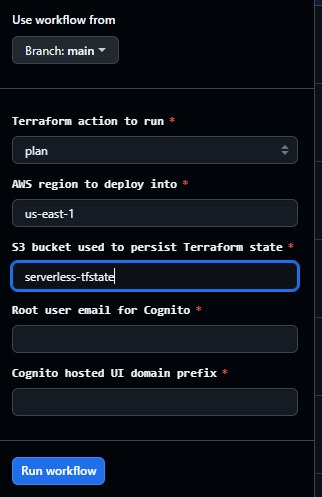

| Campo | Descripcion |
|---|---|
| `action` | Accion de Terraform: `plan`, `apply` o `destroy`. |
| `aws_region` | Region AWS donde se despliega el proyecto. Ejemplo: `us-east-1`. |
| `state_bucket` | Bucket S3 donde se guarda el estado de Terraform. |
| `root_user_email` | Email del usuario administrador inicial de Cognito. |
| `cognito_domain` | Prefijo del dominio de Cognito Hosted UI. Debe ser unico. |

Ejemplo de nombre valido para `state_bucket`:

```text
prueba-cloud-tfstate-397331402227
```

El workflow crea el bucket automaticamente si no existe. Este bucket se usa como backend remoto de Terraform para guardar el archivo `terraform.tfstate`.

Importante: al ejecutar `destroy`, Terraform elimina la infraestructura del proyecto, pero el bucket usado para el state debe borrarse manualmente desde S3 cuando ya no se necesite.

## Despliegue

Primero se recomienda correr:

```text
action = plan
```

Esto permite revisar que recursos va a crear Terraform.

Luego, si el plan es correcto, correr:

```text
action = apply
```

Al finalizar el despliegue, Terraform muestra outputs como:

```text
ocpp_api_endpoint
rest_api_endpoint
website_endpoint
ws_api_endpoint
```

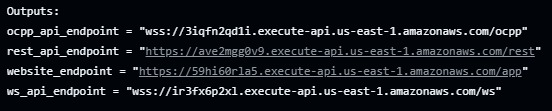

El output que se usa para entrar a la aplicacion web es:

```text
website_endpoint
```

El output que se usa para conectar el simulador OCPP es:

```text
ocpp_api_endpoint
```

## Login con Cognito

Al abrir el `website_endpoint`, la aplicacion redirige al login de Cognito.

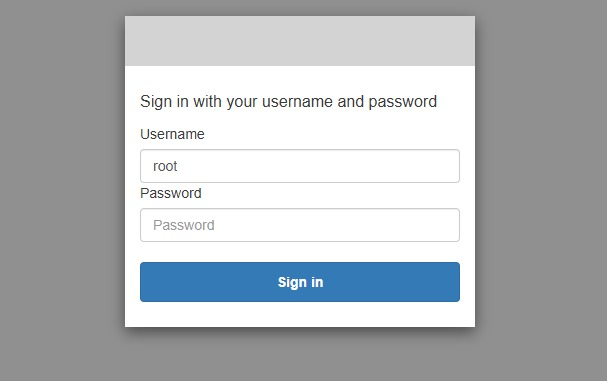

El usuario inicial creado por Terraform es:

```text
root
```

La contrasena temporal llega al mail configurado en:

```text
root_user_email
```

En el primer ingreso, Cognito solicita cambiar la contrasena.

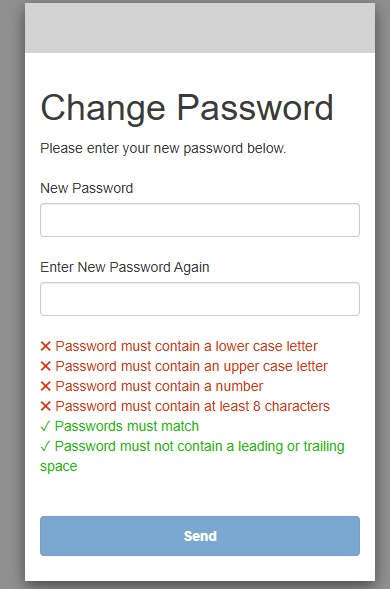

## Dashboard

Despues del login se accede al dashboard de cargadores.

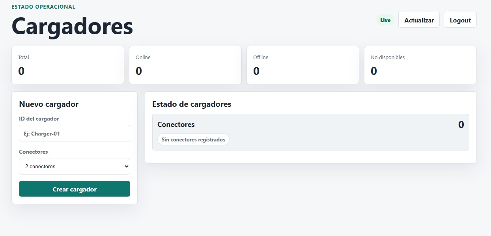

Desde esta pantalla se puede:

- Ver cargadores online/offline.
- Crear cargadores.
- Ver el estado de cada conector.
- Iniciar una carga.
- Cortar una carga.
- Borrar cargadores.
- Cerrar sesion.

## Crear un cargador

Para crear un cargador:

1. Completar el campo `ID del cargador`.
2. Seleccionar la cantidad de conectores.
3. Presionar `Crear cargador`.

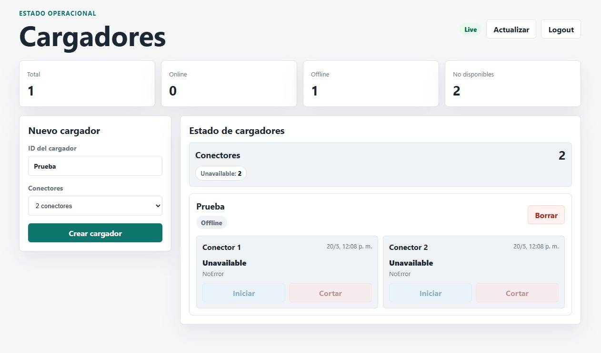

El cargador queda registrado y aparece en el panel `Estado de cargadores`.

## Configurar el simulador OCPP

Para probar el sistema se puede usar el simulador MicroOcpp:

```text
https://demo.micro-ocpp.com/
```

El endpoint base que debe usarse es el output de Terraform:

```text
ocpp_api_endpoint
```

Dentro del simulador, la URL se configura desde:

```text
Control Center -> WebSocket Options -> Backend URL
```

En `Backend URL` se debe pegar el `ocpp_api_endpoint` agregando el parametro `chargerId`:

```text
<ocpp_api_endpoint>?chargerId=<nombre_del_charger>
```

Por ejemplo, si Terraform devuelve:

```text
wss://abc123.execute-api.us-east-1.amazonaws.com/ocpp
```

y en el dashboard se creo un cargador llamado:

```text
Charger-01
```

entonces en `Control Center -> WebSocket Options -> Backend URL y Chargerbox ID` se debe configurar:

```text
wss://abc123.execute-api.us-east-1.amazonaws.com/ocpp
?chargerId=Charger-01
```

El valor de `chargerId` debe coincidir exactamente con el `ID del cargador` creado en el dashboard.

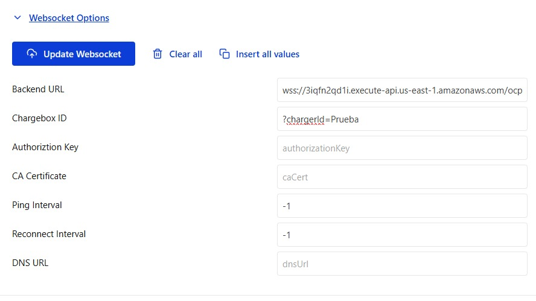

## Estados del simulador

Desde el simulador se pueden cambiar los estados de cada conector usando los botones que proporciona la interfaz. Cada cambio se refleja en el dashboard porque el frontend recibe actualizaciones en tiempo real por WebSocket.

### Estado `Unavailable`

En el simulador, `Unavailable` representa un conector no disponible para operar.

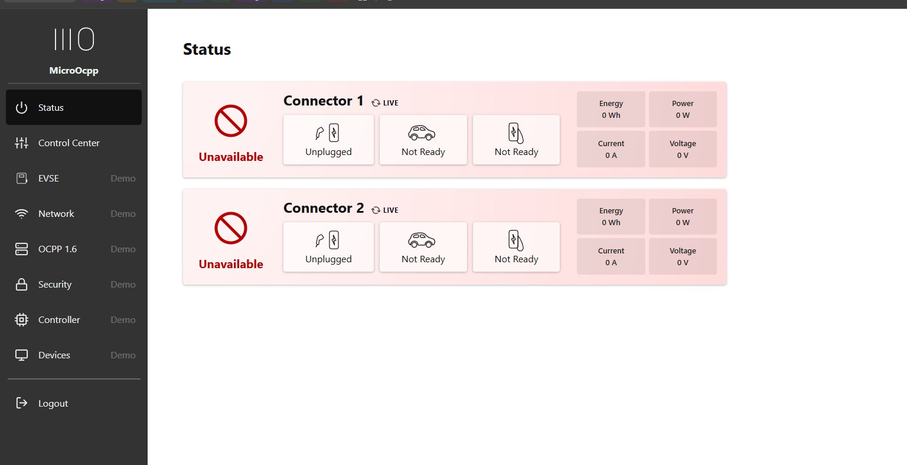

En el dashboard aparece dentro del resumen de conectores y el conector no permite iniciar ni cortar carga.

### Estado `Available`

En el simulador, `Available` indica que el conector esta libre y listo para recibir una conexion.

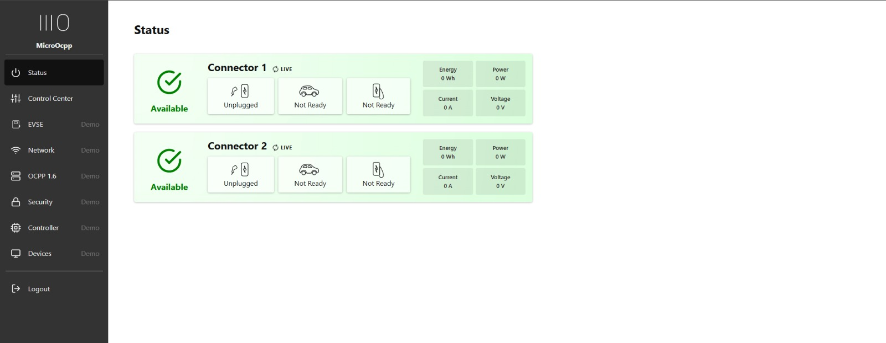

En el dashboard se ve como `Available`. En este estado los botones de accion permanecen deshabilitados porque todavia no hay vehiculo conectado.

### Estado `Preparing`

Para pasar a `Preparing`, en el simulador se toca el boton `Unplugged` para que cambie a `Plugged`. Esto representa que el vehiculo fue enchufado y el cargador esta esperando iniciar la transaccion.

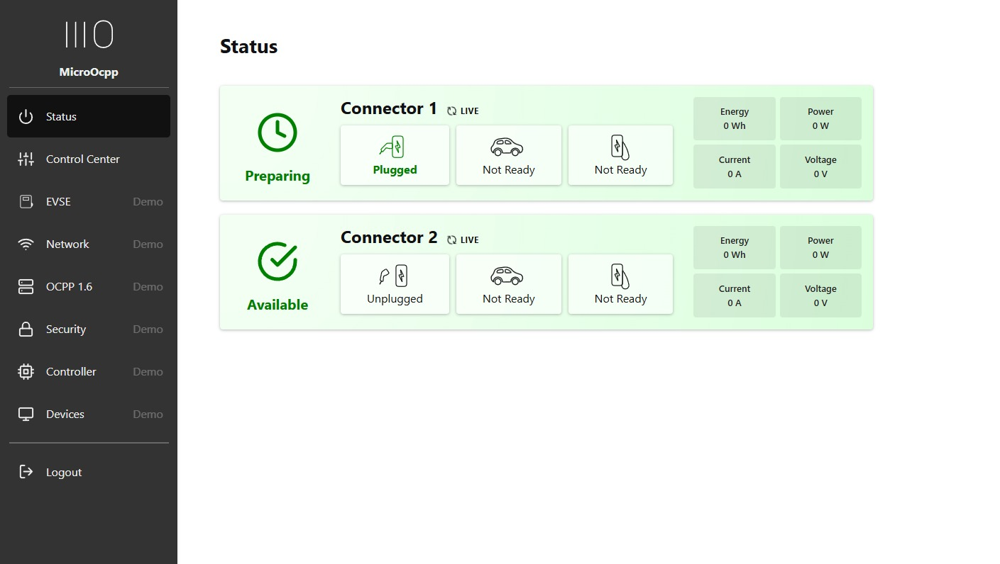

En el dashboard, cuando el conector aparece como `Preparing`, se habilita el boton `Iniciar`.

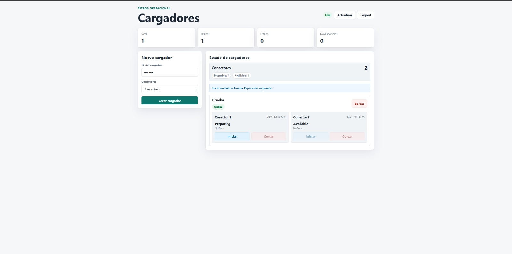

### Estado `SuspendedEVSE`

El simulador puede mostrar el conector como `SuspendedEVSE`. Esto indica que la carga esta suspendida desde el lado del cargador, pero sigue existiendo una transaccion que puede finalizarse.

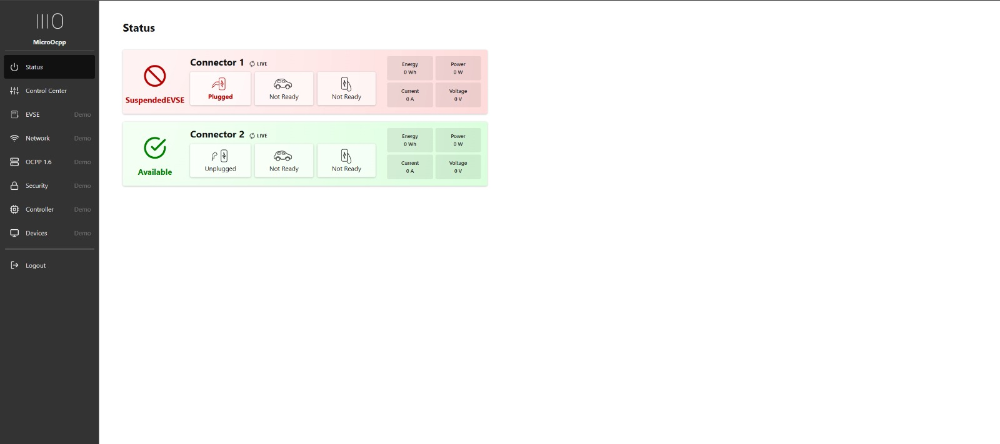

En el dashboard, `SuspendedEVSE` habilita el boton `Cortar`, para poder detener la transaccion aunque no este cargando activamente.

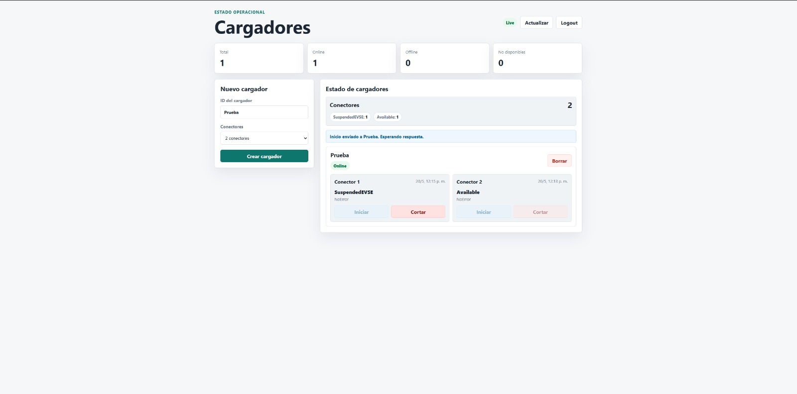

### Estado `SuspendedEV` 

El simulador puede mostrar al conector como `SuspendedEV`, indica que haycarga habilitada pero auto Not Ready

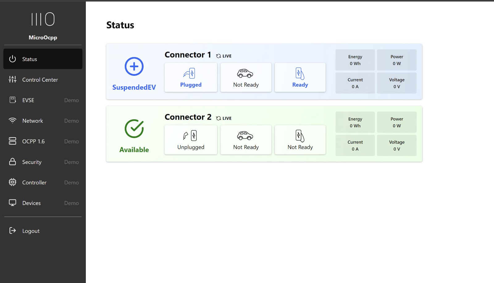

En el dashboard, `SuspendedEV` habilita el boton `Cortar`, para poder detener la transaccion aunque no este cargando activamente.

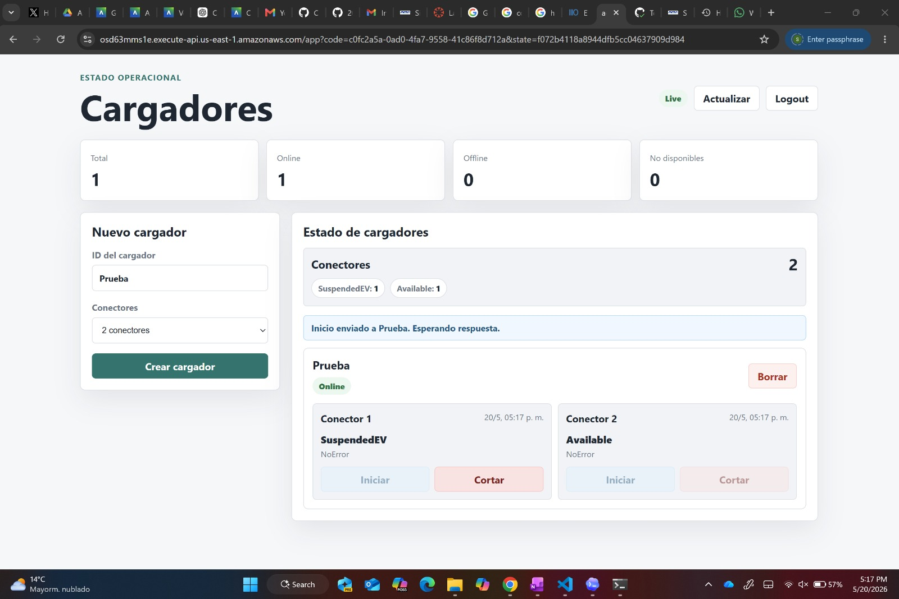

### Estado `Charging`

Despues de presionar `Iniciar` desde el dashboard, para pasar a `Charging` se tocan todos los botones del conector en el simulador hasta que queden como `Plugged`, `Ready` y `Ready`. En este estado el vehiculo esta cargando.

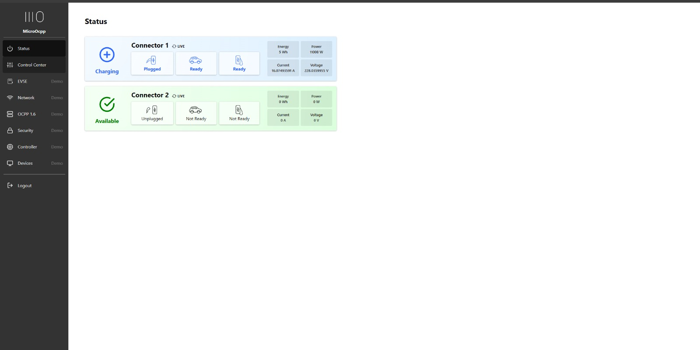

En el dashboard, cuando el conector esta en `Charging`, tambien se habilita el boton `Cortar`.

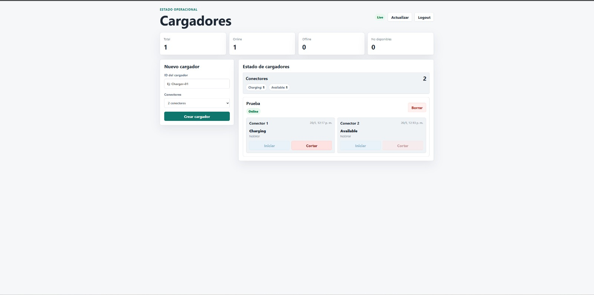

### Estado `Finishing`

Luego de enviar el corte, el simulador puede pasar a `Finishing`, que representa el cierre de la transaccion.

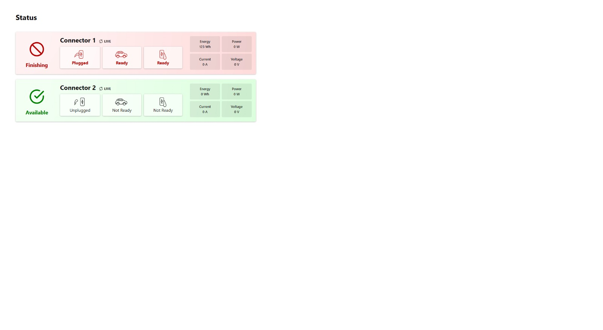

En el dashboard se muestra `Finishing` mientras se completa el cierre.

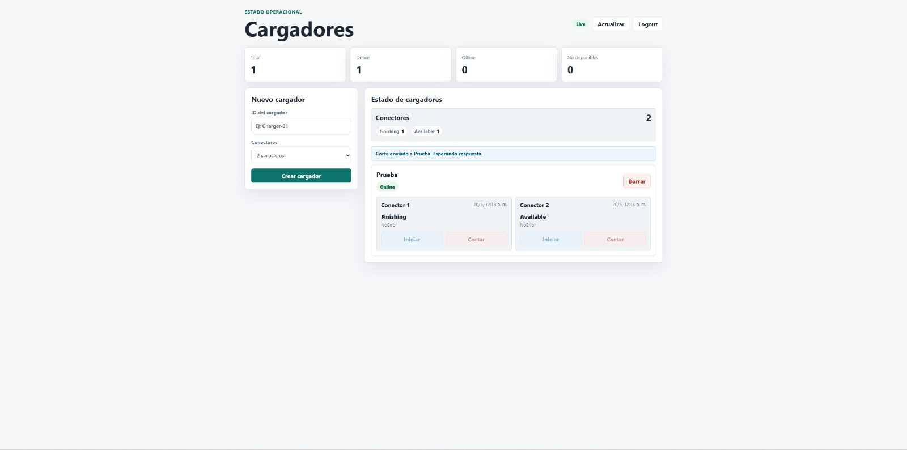

### Estado `Faulted`

El cargador o conector detectó una falla que impide operar normalmente. Usualmente requiere intervención, reinicio o diagnóstico antes de volver a estar disponible.

## Iniciar y cortar carga

Resumen de acciones disponibles:

| Estado del conector | Accion disponible en el dashboard |
|---|---|
| `Available` | Sin accion. |
| `Preparing` | `Iniciar`. |
| `SuspendedEVSE` | `Cortar`. |
| `SuspendedEV` | `Cortar`. |
| `Charging` | `Cortar`. |
| `Finishing` | Sin accion. |
| `Faulted` | sin accion. |
| `Unavailable` | Sin accion. |

El flujo principal de prueba es:

```text
Available -> tocar Unplugged -> Preparing -> Iniciar -> tocar todos los botones -> Charging -> Cortar -> Finishing -> Available
```

## Logout

El boton `Logout` usa Cognito para cerrar sesion.

El flujo es:

```text
Boton Logout -> Cognito logout -> /logout -> volver a sign in
```

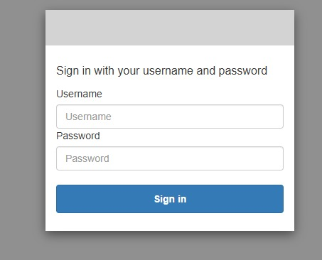

La URL `/logout` esta configurada en Terraform como logout URL del cliente de Cognito.

## Notas importantes

- `state_bucket` debe ser unico globalmente en S3.
- El bucket usado como `state_bucket` guarda el `terraform.tfstate` y debe borrarse manualmente desde S3 si se quiere eliminar todo el entorno.
- `cognito_domain` tambien debe ser unico.
- No commitear credenciales AWS.
- No commitear valores reales de secrets ni variables de entorno.
- El usuario administrador inicial es `root`.
